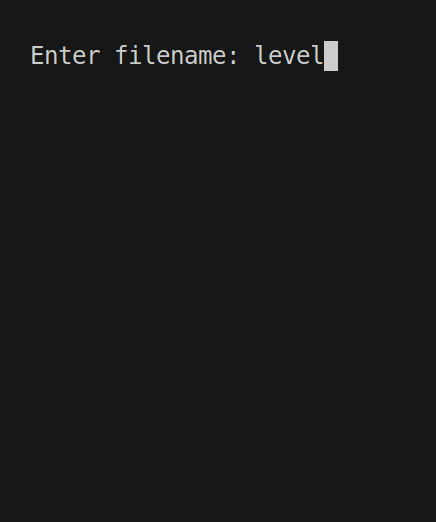
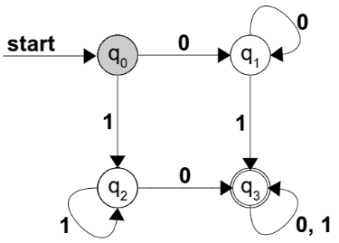
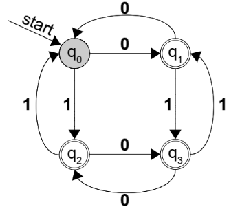
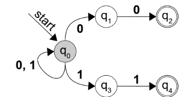
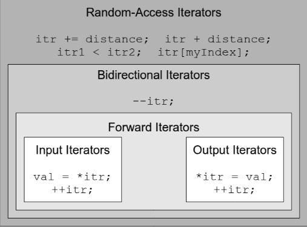
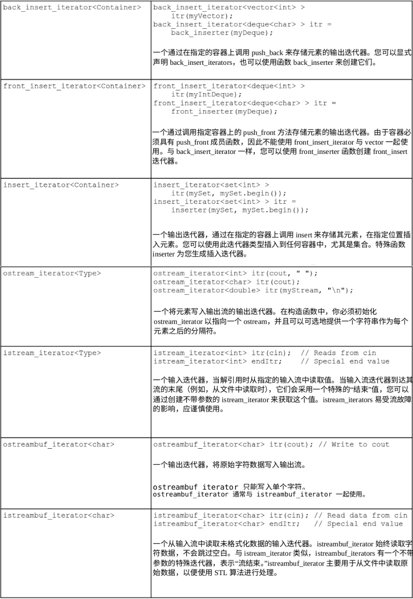

# CS106L

[书签](chrome-extension://cdonnmffkdaoajfknoeeecmchibpmkmg/assets/pdf/web/viewer.html?file=file%3A%2F%2F%2Fhome%2Fyuyou%2F%25E6%2596%2587%25E6%25A1%25A3%2FCS106L.pdf#page=27&zoom=310,-2,776)

## Introduction

- 通用编程语言
- 编译型语言
- 多范式语言
- 中级语言

## A Better C

## Stream

#### fstream

文件读取示例：

```c++
ifstream myStream("myFile.txt"); //声明类型

ifstream myStream1; //或者
myStream1.open("myFile.txt");

int myInteger;
myStream >> myInteger; //读取
```

`.is_open()`用来检查文件被正常打开
文件写入：

```c++
ofstream myStream("myFile.txt");

```

:::tip tip
当用字符串储存文件名时，要将 string 转换成 C-style string
`ifstream input(myString.c_str());`
:::

#### manipulator

- `setw`(set width)用来控制`cout`输出的宽度,头文件`<iomanip>`
  > 要输出的字数小于 width 时，前面补空白，大于时完整输出

```c++
cout << setw(10) << 111 << endl;
```

还可以控制是左空白还是右空白：

```c++
cout << '[' << left << setw(10) << "Hello!" << ']' << endl;
cout << '[' << right << setw(10) << "Hello!" << ']' << endl;
```

输出：

```txt
[          Hello!]
[Hello!          ]
```

- `setfill`和 setw 配合使用，输出大量指定字符

```c++
cout << setfill('0') << setw(8) << 1000 << endl; // 00001000
cout << setw(8) << 1000 << endl; //00001000
```

- `boolalpha` 用于将 01 转换成`true`or`false`输出(`noboolalpha`相反)

```c++
cout << true << endl; // 1
cout << boolalpha << true << endl; // true
```

- `hex`、`dec`、`oct` 进制相关（十六进制、十进制、八进制）

```c++
cout << 10 << endl; // Output: 10
cout << dec << 10 << endl; // Output: 10
cout << oct << 10 << endl; // Output: 12
cout << hex << 10 << endl; // Output: a
cin >> hex >> x; // Reads a hexadecimal value.
```

- `ws`跳过空白字符

#### 判断输入失败

`input.fail()` (`input`是`ifstream`类型)
两种方法：

```c++
while(true)
{
	if(input.fail()) break;
	...
}
```

```c++
while(input >> myValue)
{
	...
}
```

#### stirngstream

头文件`<sstream>`
`stringstream`用临时字符串缓存区读写数据
可以解决混合类型输入输出问题
可以将混合类型分开储存

```c++
int levelNum = /* ... */;
stringstream messageText;
messageText << "Level " << levelNum << " is out of bounds.";
MessageBoxAlert(messageText.str());
```

```c++
stringstream myConverter;
int myInt;
string myString;
double myDouble;
myConverter << "137 Hello 2.71828";// Insert string data
myConverter >> myInt >> myString >> myDouble; // Extract mixed data
```

和进制转化配合使用：

```c++
stringstream st;
int num = 15;
st << hex << num;//将数字转化成十六进制字符串
st >> hex >> num;//将st作为十六进制输入，num == 15;
st >> num; //默认也是作为十六进制，num == 15;
st >> dec >> num; //发生错误，num == 0;
string s = st.str();// s = "f"
```

#### getline

读取整行
`getline(stream, stirng, '\n')`

#### 拓展

##### Random Access

自由移动读取位置

- `seekp`和`seekg`
  可以将 “p” 理解为 “put”，将 “g” 理解为 “get”

```c++
ios::beg	//从文件头开始计算偏移量
ios::end	//从文件末尾开始计算偏移量
ios::cur	//从当前位置开始计算偏移量
```

```c++
file.seekp(32L, ios::beg);//将写入位置设置为从文件开头开始的第 33 个字节（字节 32)
file.seekp(-10L, ios::end);//将写入位置设置为从文件末尾开始的第 11 个字节（字节 10)
file.seekp(120L, ios::cur);//将写入位置设置为从当前位置开始的第 121 个字节（字节 120)
file.seekg(2L, ios::beg);//将读取位置设置为从文件开头开始的第 3 个字节（字节 2)
file.seekg(-100L, ios::end);//读取位置设置为从文件末尾开始的第 101 个字节（字节 100)
file.seekg(40L, ios::cur);//将读取位置设置为从当前位置开始的第 41 个字节（字节 40)
file.seekg(0L, ios:rend);//将读取位置设置为文件末尾
```

- `tellp`和`tellg`
  都是返回当前位置

## Multi-File Programs, Abstraction, and the Preprocessor(多文件处理、抽象和预处理器)

#### C++编译过程

- preprocessing 拼接插入代码，比如头文件
- compilation 代码被转换成目标代码，检查语法错误
- linking 代码片段被链接在一起，检查函数原型和实现错误

#### 代码模块化、抽象化

优点：

- 简单化（易读）
- 可拓展性
- 复用性

#### include guard

在头文件开头结尾设置，防止重复导入

```c++
#ifndef File_Included
#define File_Included

#endif
```

#### 多文件运行

一个函数会被分在两个文件
`FileName.h`头文件定义函数原型，同名`FileName.cpp`c++文件实现
在`vscode`中想要多文件运行：
用`g++`命令

```sh
g++ -g ./main.cp ./swap.cpp -o main
```

`main`是生成可执行文件的名字
然后直接在终端执行：

```sh
./main
```

#### 预处理指令

例如：`#include`、`#define`

- 必须独占一行
- 必须在行首

##### `#define`

```c++
#define phrases replacement
```

替换代码中所有`phrases`为`replacement`
:::tip 提示
只是单纯的替换，不会考虑运算优先级，当要替换为表达式时，最好加上括号
因为`#define`容易出错，最好使用`const`
:::
两者间的分隔为第一个空格
`replacement`为从空格到换行符之前（所以为空也合法）

##### `#if`

```c++
#if statement
...
#elif another-statement
...
#elif yet-another-statement
...
#else
...
#endif
```

只能使用`#define`的常量、整数、算数和逻辑表达式
可以用来注释（可嵌套）
`#if defined()`的返回值：
如果被定义过返回 true
没有没定义过返回 false

##### `#ifdef`

相当于`#if defined`
如果被定义过返回 true

##### `#ifndef`

相当于`if not defined`
如果被定义过返回 false

##### `#undef`

取消定义

##### `#error`

当预处理器读到这个时，会在编译时出错，并显示错误信息
`#error message`

#### Macros 宏

语法格式：

```c++
#define macroname(parameter1, parameter2, ... , parameterN) macro-body
```

eg:

```c++
#define Max(a, b) ((a) > (b) ? (a) : (b))
```

:::tip 提示
能用 c++代码实现的就少用宏定义，容易出错
:::

#### Inline Functions(内联函数)

```c++
inline int max(int one, int two)
{
	return one > two ? one : two;
}
```

比宏定义安全
只是建议，交由编译器处理

#### 预处理器的一些技巧

##### 特殊值

`__DATE__`当前日期
`__TIME__`当前时间
`__LINE__`当前行
`__FILE__`当前文件名

##### 字符串类型操作

用带`#`能保留原参数的字符串
eg:

```c++
#define PRINTOUT(n) cout << #n << " has value " << (n) << endl

int x = 137;
PRINTOUT(x * 42);
```

将会被转换为：

```c++
int x = 137;
cout << "x * 42" << " has value " << (x * 42) << endl;
```

用带`##`可以将两个参数连接在一起,(字符粘贴)
eg：生成包含输入参数的变量

```c++
#define DECLARE_MY_VAR(type) type my_##type

DECLARE_MY_VAR(int);
```

转换为：

```c++
int my_int;
```

#### X Macro trick

将需要的数据放在`.h`文件里格式为`macroname(arguments)`
格式：

```c++
#define macroname(arguments) //定义使用参数的方法
#define "filename.h" //导入参数
#undef macroname //取消定义,避免后面发生冲突
```

优点：
代码更简短
改动更方便（只需要更改`.h`文件中的数据）

## STL Sequence Containers

标准模板库可以被分为六个部分：

- 容器
- 迭代器
- 算法
- 适配器
- functors
- 分配器

### vector

`v.push_back(num)`向 vector 尾部添加一个新元素 num
`v.pop_back()`将尾部元素删除
`v.insert(v.begin()+position, num)`在位置 position 插入一个元素 num
`v.erase(v.begin()+position)`删除 position 位置的元素
`v.resize(size, num)`更改元素数量，如果 size 大于原本数量，则多出的被填充为 num
`v.clear()`清除 vector 中的所有元素
`v.end()`
`v.begin()`
`v.back()`
`v.front()`

### deque 双端队列

除支持所有`vector`操作外
`push_front`
`pop_front`

### 实例：贪吃蛇

[具体代码实现](贪吃蛇实例.md)<br>
效果：


### busy loop 忙等待循环

可以用来实现程序等待一段时间再执行

头文件`<ctime>`
`clock()`函数返回程序开始以来经过的时钟滴答数

> 时钟滴答持续时间因系统而异，C++提供了`CLOCKS_PER_SEC`常量将其转化为秒

### rand 随机数

头文件`<cstdlib>`
_rand()_ 返回一个介于`0`-`RAND_MAX`的整数(RAND*MAX 通常为`32767`)
\_srand()* 为`rand()`设定种子值，否则生成的随机数序列是相同的
eg:

```c++
srand(static_cast<unsigned int>(time(NULL)));

double random_number = rand() / (RAND_MAX + 1.0); //返回[0, 1)的小数
```

### more to explore

- stack & queue
- valarray

## STL Associative Containers and Iterators

### `set`集合

表示一个不允许重复元素的未排序元素集合
:::tip tip
只能存储可以比较大小的类型，不能存储自定义结构体
:::
`set`函数：

| 函数声明                                                                      | 示例                                          | 功能                                                                                                                                     |
| ----------------------------------------------------------------------------- | --------------------------------------------- | ---------------------------------------------------------------------------------------------------------------------------------------- |
| `Constructor: set<T>()`                                                       | `set<int> mySet;`                             | 构建一个空集合                                                                                                                           |
| `Constructor: set<T>(const set<T>& other)`                                    | `set<int> myOtherSet = mySet;`                | 构建一个与另一个集合相同的集合                                                                                                           |
| `Constructor: set<T>(InputIterator start, InputIterator stop)`                | `set<int> mySet(myVec.begin(), myVec.end());` | 构建一个包含指定范围`[start, stop)` 中元素副本的集合。任何重复的元素都会被丢弃，并且元素会被排序。并且，此函数接受来自任何来源的迭代器。 |
| `size_type size() const`                                                      | `int numEntries = mySet.size();`              | 返回集合中包含的元素数量                                                                                                                 |
| `bool empty() const`                                                          | `if(mySet.empty()) { ... }`                   | 返回集合是否为空                                                                                                                         |
| `void clear()`                                                                | `mySet.clear();`                              | 清空集合                                                                                                                                 |
| `iterator begin() const_iterator begin() const`                               | `set<int>::iterator itr = mySet.begin();`     | 返回集合开头的迭代器                                                                                                                     |
| `iterator end()<br>const_iterator end()`                                      | `while(itr != mySet.end()) { ... }`           | 返回集合最后一个元素之后的迭代器                                                                                                         |
| `pair<iterator, bool> insert(const T& value)`                                 | `mySet.insert(4);`                            | 插入指定的值，返回元素迭代器和`bool`的元组(表示元素是否成功插入，为`true`, 或已存在`false`)                                              |
| `void insert(InputIterator begin,InputIterator end)`                          | `mySet.insert(myVec.begin(), myVec.end());`   | 将指定的元素范围插入到集合中，忽略重复项                                                                                                 |
| `iterator find(const T& element) const_iterator find(const T& element) const` | `if(mySet.find(0) != mySet.end()) { ... }`    | 返回指定元素（如果存在）的迭代器，否则返回结束                                                                                           |
| `size_type count(const T& item) const`                                        | `if(mySet.count(0)) { ... }`                  | 如果指定的元素包含在集合中,返回 1，否则返回 0                                                                                            |
| `size_type erase(const T& element)`                                           | `if(mySet.erase(0)) {...} `                   | 删除集合中的元素。在第一种版本中，如果找到指定元素，则将其删<br>除，如果元素在集合中，则函数返回 1，否则返回 0。                         |
| `void erase(iterator itr);`                                                   | `mySet.erase(mySet.begin());`                 | 第二种版本删除由<br>itr 指向的元素                                                                                                       |
| `void erase(iterator start, iterator stop);`                                  | `mySet.erase(mySet.begin(), mySet.end());`    | 最终版本删除范围`[start, stop)`内的元素                                                                                                  |
| `iterator lower_bound(const T& value)`                                        | `itr = mySet.lower_bound(5);`                 | 返回一个迭代器，指向第一个大于或等于指定值的元素                                                                                         |
| `iterator upper_bound(const T& value)`                                        | `itr = mySet.upper_bound(100);`               | 返回一个迭代器，指向第一个大于指定值的元素                                                                                               |

### Iterator 迭代器

_begin()_ 函数返回第一个元素的迭代器
_end()_ 函数返回指向容器末尾的下一个元素的迭代器
数据范围为`[begin, end)`
eg:遍历一个 vector

```c++
for(vector<int>::iterator itr = myVector.begin();
itr != myVector.end(); ++itr)
	cout << *itr << endl;
```

#### 二分查找函数

_lower_bound()_ 接受一个值，返回容器中第一个大于等于该值的元素的迭代器
_upper_bound()_ 接受一个值，返回容器中第一个大于该值的元素的迭代器

### pair

`pair`是一个简单的容器类型,它可以存储两个不同类型的元素
头文件`<utility>`
声明 `pair<TypeOne, TypeTwo>`
eg:

```c++
pair<int, string> myPair;
myPair.first = 37;
myPair.second = "C++ is awesome!";
```

`make_pair()`函数：可以在定义的同时初始化

```c++
pair<int, string> muPair = make_pair(137, "string!");
```

### map

用来表示映射关系
map 中的数据被存在键值对中
在幕后，map 使用平衡二叉树实现，因此和`set`类似，`map`中的键必须可以通过小于号比较，但值不需要，可以用自定义结构体
eg:创建并赋值

```c++
map<string, int> numberMap;

//使用[]会隐式创建键值对，如果不赋值默认赋0
numberMap["zero"] = 0;
numberMap["one"] = 1;
numberMap["two"] = 2;

//显式创建
numberMap.insert(make_pair("zero", 0));
```

:::tip tip
这两种方式在键已存在时有区别
第一种直接赋值会覆盖为最新的值
第二种插入会失败，保留原有的值并返回`pair<iterator, false>`
:::

如果想在查找键值对时，不意外创建新的键值对，可以使用 _find()_ 函数
`map`的元素解引用后是键值对

```c++
map<string, int>::iterator itr = numberMap.find("xyzzy");
if(itr == numberMap.end())
	cout << "Key does not exist." << endl;
else
	cout << "Key " << itr->first << " has value " << itr->second << endl;
```

删除：
_myMap.erase("key")_

`map`函数

| 声明                                                                                                     | 示例                                                                                             | 功能                                                                                                                                                              |
| -------------------------------------------------------------------------------------------------------- | ------------------------------------------------------------------------------------------------ | ----------------------------------------------------------------------------------------------------------------------------------------------------------------- |
| `Constructor: map<K, V>()`                                                                               | `map<int, string> myMap;`                                                                        | 构建一个空映射                                                                                                                                                    |
| `Constructor: map<K, V>(const map<K, V>& other)`                                                         | `map<int, string> myOtherMap = myMap;`                                                           | 构建一个与另一个映射相同的映射                                                                                                                                    |
| `Constructor: map<K, V>(InputIterator start, InputIterator stop)`                                        | `map<string, int> myMap(myVec.begin(), myVec.end());`                                            | 构建一个包含指定范围 `[start, stop)` 中元素副本的映射。任何重复的元素都会被丢弃，并且元素会被排序。并且，此函数接受来自任何来源的迭代器，但它们必须是键值对迭代器 |
| `size_type size() const`                                                                                 | `int numEntries = myMap.size();`                                                                 | 返回映射中包含的元素数量                                                                                                                                          |
| `bool empty() const`                                                                                     | `if(myMap.empty()) { ... }`                                                                      | 返回`map`是否为空                                                                                                                                                 |
| `void clear()`                                                                                           | `myMap.clear();`                                                                                 | 清空`map`                                                                                                                                                         |
| `iterator begin() const_iterator begin() const`                                                          | `map<int>::iterator itr = myMap.begin();`                                                        | 返回到映射开始的迭代器                                                                                                                                            |
| `iterator end() const_iterator end()`                                                                    | `while(itr != myMap.end()) { ... }`                                                              | 返回一个迭代器，指向映射中最后一个元素之后的元素                                                                                                                  |
| `pair<iterator, bool> insert(const pair<const K, V>& value)`                                             | `myMap.insert(make_pair("STL", 137));`                                                           | 第个版本将指定的键/值对插入到映射中。返回类型是一个包含对元素的迭代器和表示元素是否成功插入（true）或已存在（false）的布尔值的对                                  |
| `void insert(InputIterator begin, InputIterator end)`                                                    | `myMap.insert(myVec.begin(), myVec.end());`                                                      | 第二次版本将指定的元素范围插入到映射中，忽略重复项                                                                                                                |
| `V& operator[] (const K& key)`                                                                           | `myMap["STL"] = "is awesome";`                                                                   | 如果存在，返回与指定键关联的值。如果不存在，将创建一个新的键/值对，并将值初始化为零（如果是原始类型）或默认值（对于非原始类型）。                                 |
| `iterator find(const K& element) const_iterator find(const K& element) const`                            | `if(myMap.find(0) != myMap.end()) { ... }`                                                       | 如果存在指定键的键/值对，返回一个该键值对的迭代器，否则返回`end`迭代器                                                                                            |
| `size_type count(const K& item) const`                                                                   | `if(myMap.count(0)) { ... }`                                                                     | 如果映射中存在具有指定键的键/值对，返回 1，否则返回 0                                                                                                             |
| `size_type erase(const K& element) void erase(iterator itr); void erase(iterator start, iterator stop);` | `if(myMap .erase(0)) {...} myMap.erase(myMap.begin()); myMap.erase(myMap.begin(), myMap.end());` | 删除元素，或迭代器对应的元素，以及迭代器范围内的元素                                                                                                              |
| `iterator lower_bound(const K& value)`                                                                   | `itr = myMap.lower_bound(5);`                                                                    | 返回一个迭代器，指向第一个键/值对，其键大于或等于指定的值                                                                                                         |
| `iterator upper_bound(const K& value)`                                                                   | `itr = myMap.upper_bound(100);`                                                                  | `返回一个迭代器，该迭代器指向第一个键/值对，其键大于指定的值`                                                                                                     |

### 实例：关键词计数器

[具体代码实现](关键词计数器实例) <br>
效果：

```txt
Enter filename: keyword_counter.cpp
Keyword and occurred 1 times.
Keyword for occurred 6 times.
Keyword if occurred 3 times.
Keyword int occurred 1 times.
Keyword namespace occurred 1 times.
Keyword operator occurred 2 times.
Keyword or occurred 1 times.
Keyword return occurred 4 times.
Keyword true occurred 1 times.
Keyword using occurred 1 times.
Keyword void occurred 3 times.
Keyword while occurred 4 times.
```

### Multicontainers

STL 提供了多容器类，即`multimap`和`multiset`，它们存储的值/键可以不唯一
语法和`map`/`set`相同，函数略有不同
_count()_ 返回元素在容器中的数量，不仅仅是 0 或 1
_find()_ 返回一个指向该元素的迭代器，但不保证唯一
_erase()_ 将删除该键/值的所有副本

`multimap`中`myMap[key] = value`方括号的方式不再有效，需要用`insert`函数插入

对于多容器有用的函数：
_equal_range()_ 返回一个`pair<iterator, iterator>`,表示等于指定值的范围
eg:遍历`multimap`中所有键等于`STL`的条目

```c++
pair<multimap<string, int>::iterator, multimap<string, int>::iterator>
	myPair = myMultiMap.equal_range("STL");
for(multimap<string, int>::iterator itr = myPair.first;
	itr != myPair.second; ++itr)
	cout << itr->first << ": " << itr->second << endl;
```

### 拓展： 确定有限自动机

确定有限自动机`DFA`（_Deterministic Finite Automata_）

> 是一种处理信息和识别模式的数学模型。它由一个有限的状态集合和一组转换规则组成，这些规则定义了在给定输入下状态之间的转换

状态图：

**在结束时处于双圈内，才接受输入**
此 DFA 接受至少包含一个 0 和一个 1 的字符串

此 DFA 接受所有包含奇数个 0 或奇数个 1 的字符串
一个 DFA 由下面 5 条信息表示：

1. DFA 使用的状态集合
2. DFA 的字母表
3. 初始状态
4. 状态转换
5. 接受状态集合
   第 1、2、4 可以用表格表示：
   给定当前状态和输入符号要转换到的状态

| 状态  | 0     | 1     |
| ----- | ----- | ----- |
| $q_0$ | $q_1$ | $q_2$ |
| $q_1$ | $q_0$ | $q_3$ |
| $q_2$ | $q_3$ | $q_0$ |
| $q_3$ | $q_2$ | $q_1$ |

[代码实现](确定有限自动机.md)<br>

### 非确定有限自动机

_NFA_ (`nondeterministic finite automaton`)
不同于 _DFA_ ,NFA 中的状态可以有任意数量的转换（包括 0)

如图在$q_0$处有两个`0`和两个`1`状态
有两种解释：

- 非确定性地选择一条路径
- 同时处于不同的状态
  [具体代码实现](非确定有限自动机.md)<br>
  与 _DFA_ 的区别在于`map`改为`multimap`，对应可以有多种选择路径

### more to explore

- list ：列表，链表实现的顺序容器
- Boost ：用于增强原生库支持的函数和类，例如`unordered_set`和`unordered_map`使用哈希而不是树结构存储数据

## STL Algorithms

优点：

- 简单性
- 正确性
- 速度
- 清晰性

### 累加

头文件`<numeric>`
_accumulate(itr, itr, value)_ 输入两个定义范围的迭代器，和初始值

### 算法命名规范

- 后缀`_if` 在满足某种情况时执行函数
  如 _count_if(itr, itr, bool)_
  相比 _count(itr, itr, value)_ 统计范围中等于该值的次数
  该函数在 bool 函数为`true`时计数

```c++
bool IsEven(int value)
{
	return value % 2 == 0;
}

cout << counr_if(myVec.begin(), muVec.end(), IsEven) << endl;
```

- 包含`copy` 将结果存储在额外位置
  如 _remove_copy()_ _partial_sort_copy()_
- 以`_n`结尾 执行某操作 n 次
  如 _genetrate_n()_ _search_n()_
  相比 _fill(itr, itr, value)_ 在范围内填充为 value
  _fill_n(itr, cnt, value)_ 以一个迭代器为开始填充 cnt 个数

```c++
fill(myDeque.begin(), myDeque.end(), 0);
fill_n(myDeque.begin(), 10, 0);
```

### 迭代器类别

在`vector`和`deque`中为了指定某个元素的迭代器，可以使用`myVec.begin()+n`的语法
但在`map`及`set`中`+`运算符被禁止，防止效率低下

- 输出迭代器 只能写入值 `*myItr = value` 可以用`++`向前移动
- 输入迭代器 只能读取值 `value = *myItr`
- 前向迭代器 结合了输出和输入迭代器 但只能向前`++` 不能`--`
- 双向迭代器 包含了前向迭代器的功能 此外可以用`--` 但不能`+`及`+=` 是` map``set `使用的迭代器
- 随机访问迭代器 包含了最多的功能 是`vector`和`deque`使用的迭代器
  

### 排序算法

_sort(itr, itr)_ 对范围内元素按升序排序 迭代器必须是随机访问迭代器
可以指定一个比较函数，自定义排序方式

```c++
struct placeT
{
	int x;
	int y;
};

bool cmp(placeT one, placeT two)
{
	if(one.x != two.x)
		return one.x < two.x;
	return one.y < two.y;
}

sort(myPlaceVecor.begin(), myPlaceVecor.end(), cmp);
```

_random_shuffle(itr, itr)_ 随机打乱元素位置，不需要传递比较函数
迭代器也必须是随机访问迭代器
函数内部使用`rand()`生成随机数，因此在使用函数前应该使用`srand()`初始化

_rotate(itr, itr+n, itr)_ 对范围内元素循环 接受开始、中间、结束迭代器
`rotate(v.begin(), v.begin() + 2, v.end())`
会对`(0, 1, 2, 3, 4, 5)`围绕第三个元素`2`循环，结果`(2, 3, 4, 5, 0, 1)`

### 搜索算法

虽然`set`和`map`自然支持查找，但`vector`和`deque`缺少这种功能
_find(itr, itr, value)_ 在范围内查找值，如果找到返回范围内第一个具有该值的迭代器，如果没有返回第二个迭代器

```c++
if(find(myVector.begin(), myVector.end(), 137) != myVector.end())
/* ... vector contains 137 ... */
```

::: tip tip
如果一个容器类有一个和算法同名的成员函数，应该尽可能使用成员函数，成员函数有针对性的优化，速度快
:::
_binary_search(itr, itr, bool)_ 和 sort 类似，如果使用特殊比较函数排序，也该使用该函数作为参数
该函数不返回迭代器，只是检查是否在容器中，如果想获取迭代器，可以使用 _lower_bound()_

### 迭代适配器

头文件`<iterator>`
是类似迭代器的对象，可以用`*`解引用，并用`++`向前推进，但实际并不指向容器中的元素
比如：

```c++
ostream_iterator<int> myItr(cout, " ");
*myItr = 137;
++myItr;
*myItr = 42;
++myItr;
```

这段代码会输出`137 42`
给迭代器解引用赋值后会写入到`cout`中
迭代适配器本身就是迭代器，可以和 STL 算法一起使用，用来"欺骗“算法
例如：
_copy(itr, itr, itr3)_ 会复制范围内的元素到新的迭代器指向的目标

```c++
copy(myVector.begin(), myVector.end(), ostream_iterator<int>(cout, " "));
```

这段代码会将`myVector`的内容打印出来

特殊迭代器适配器：插入迭代器 （是输出迭代器）
使用`insert`、`push_back`或`push_front`函数将值插入到容器中
例如：_back_insert_iterator()_ 会调用`push_back`来存储值

```c++
vector<int> myVector;
back_insert_iterator<vector<int>> itr(myVector);
//写入itr的任何值将通过调用push_back存储在myVector
for(int i = 0; i< 10; ++i)
{
	*itr = i; //隐式调用myVector.push_back(i)
	++itr;
}
copy(myVector.begin(), myVector.end(), ostream_iterator<int>(cout, " "));
```

这种迭代器几乎仅作为需要储存结果位置参数的 STL 算法使用
例如：假设我们想使用`reverse_copy`来制作一个与原始顺序相反的副本

```c++
vector<int> original = {...};
vector<int> destination;
reverse_copy(original.begin(), original.end(), back_insert_iterator<vector<int>>(destination));
```

`back_insert_iterator<vector<int>>(destination));`可以简写为：
`back_inserter(destination);`

_set_union()_ 、_set_intersection()_ 、_set_difference()_
是计算并集、交集、差集的函数，接受五个参数：两个迭代器范围对，以及一个最终位置迭代器

```c++
set<int> result;
set_union(setOne.begin(), setOne.end(),
	setTwo.begin(), setTwo.end(),
	inserter(result, result.begin()));
```

_inserter(result, result.begin())_ 插入迭代器，将元素插入结果集中
_istream_iterator()_ 输入迭代器 可以从流中读取值
改进本章最开始的计算平均数函数：

```c++
copy(istream_iterator<int>(input), istream_itetator<int>(),
	inserter(values, values.begin()));
```

迭代器适配器函数表：


### 移除算法

_remove(itr, itr, value)_ 会将容器的内容向下移动来覆盖需要删除的元素，==并不是真正删除== ，返回一个指向第一个不在修改范围内的元素的迭代器
如果想真正删除：
`myVector.erase(remove(myVector.begin(), myVector.end(), 137), myVector.end());`

### 其他值得注意的算法

_transform(itr_start, itr_end, itr_start_new, function)_ 输入一个范围，将范围内的每个元素经过处理后输出给目标迭代器
例如：将字符串转小写

```c++
string to_lower(string text)
{
    transform(text.begin(), text.end(), text.begin(), ::tolower);
    //兼容性问题：有两个tolower函数，编译器无法区分，使用：：明确使用的是<cctype>的原始的函数
    return text;
}
```

常用 STL 函数列表：

| 函数声明                                                                                                                 | 描述                                                                                |
| ------------------------------------------------------------------------------------------------------------------------ | ----------------------------------------------------------------------------------- |
| `Type accumulate(InputItr start,InputItr stop,Type value)`                                                               | 返回`[start, stop)`范围内的元素的总和加上 Value 的值                                |
| `bool binary_search(RandomItr start,RandomItr stop,const Type& value)`                                                   | 二分搜索，返回是否在范围内找到 value,如果使用特殊比较函数，将该函数指定为最后的参数 |
| `OutItr copy(InputItr start,  InputItr stop,  OutItr outputStart)`                                                       | 将范围内的元素复制到输出迭代器，返回指向写入范围末尾的迭代器                        |
| `size_t count(InputItr start,InputItr end,const Type& value)`                                                            | 返回在范围内等于 value 的数量                                                       |
| `size_t count_if(InputItr start,  InputItr end,  PredicateFunction fn)`                                                  | 返回在范围内 fn 函数为 true 的元素数量                                              |
| `bool equal(InputItr start1,  InputItr stop1,  InputItr start2)`                                                         | 返回范围内元素和另一个开始范围内元素是否相等                                        |
| `pair<RandomItr, RandomItr>  equal_range(RandomItr start,  RandomItr stop,  const Type& value)`                          | 返回一对迭代器，定义了一个范围，在范围内的元素都等于 value                          |
| `void fill(ForwardItr start,  ForwardItr stop,  const Type& value)`                                                      | 将范围内的元素都设置为 value                                                        |
| `void fill_n(ForwardItr start,  size_t num,  const Type& value)`                                                         | 将从开始的 n 个元素设置为 value                                                     |
| `InputItr find(InputItr start,  InputItr stop,  const Type& value)`                                                      | 返回一个迭代器，指向范围内第一个等于 value,如果没有，指向 stop                      |
| `InputItr find_if(InputItr start,  InputItr stop,  PredicateFunc fn)`                                                    | 指向第一个使 fn 为真的元素                                                          |
| `Function for_each(InputItr start,  InputItr stop,  Function fn)`                                                        |                                                                                     |
| `void generate(ForwardItr start,  ForwardItr stop,  Generator fn);`                                                      |                                                                                     |
| `void generate_n(OutputItr start,  size_t n,  Generator fn);`                                                            |                                                                                     |
| `bool includes(InputItr start1,  InputItr stop1,  InputItr start2,  InputItr stop2)`                                     |                                                                                     |
| `Type inner_product(InputItr start1,  InputItr stop1,  InputItr start2,  Type initialValue)`                             |                                                                                     |
| `bool  lexicographical_compare(InputItr s1,  InputItr s2,  InputItr t1,  InputItr t2)`                                   |                                                                                     |
| `InputItr  lower_bound(InputItr start,  InputItr stop,  const Type& elem)`                                               |                                                                                     |
| `InputItr max_element(InputItr start,  InputItr stop)`                                                                   |                                                                                     |
| `InputItr min_element(InputItr start,  InputItr stop)`                                                                   |                                                                                     |
| `bool next_permutation(BidirItr start,  BidirItr stop)`                                                                  |                                                                                     |
| `bool prev_permutation(BidirItr start,  BidirItr stop)`                                                                  |                                                                                     |
| `void random_shuffle(RandomItr start,  RandomItr stop)`                                                                  |                                                                                     |
| `ForwardItr remove(ForwardItr start,  ForwardItr stop,  const Type& value)`                                              |                                                                                     |
| `ForwardItr  remove_if(ForwardItr start,  ForwardItr stop,  PredicateFunc fn)`                                           |                                                                                     |
| `void replace(ForwardItr start,  ForwardItr stop,  const Type& toReplace,  const Type& replaceWith)`                     |                                                                                     |
| `void replace_if(ForwardItr start,  ForwardItr stop,  PredicateFunction fn,  const Type& with)`                          |                                                                                     |
| `ForwardItr rotate(ForwardItr start,  ForwardItr middle,  ForwardItr stop)`                                              |                                                                                     |
| `ForwardItr search(ForwardItr start1,  ForwardItr stop1,  ForwardItr start2,  ForwardItr stop2)`                         |                                                                                     |
| `InputItr set_difference(  InputItr start1,  InputItr stop1,  InputItr start2,  InputItr stop2,  OutItr dest)`           |                                                                                     |
| `InputItr set_intersection(  InputItr start1,  InputItr stop1,  InputItr start2,  InputItr stop2,  OutItr dest)`         |                                                                                     |
| `InputItr set_union(  InputItr start1,  InputItr stop1,  InputItr start2,  InputItr stop2,  OutItr dest)`                |                                                                                     |
| `InputItr set_symmetric_difference(  InputItr start1,  InputItr stop1,  InputItr start2,  InputItr stop2,  OutItr dest)` |                                                                                     |
| `void swap(Value& one, Value& two)`                                                                                      |                                                                                     |
| `OutputItr transform(InputItr start,  InputItr stop,  OutputItr dest,  Function fn)`                                     |                                                                                     |
| `RandomItr  upper_bound(RandomItr start,  RandomItr stop,  const Type& val)`                                             |                                                                                     |

### 拓展示例：回文

## Data Abstraction

## Object-Oriented Programming

## Generic Programming

## More to Explore
