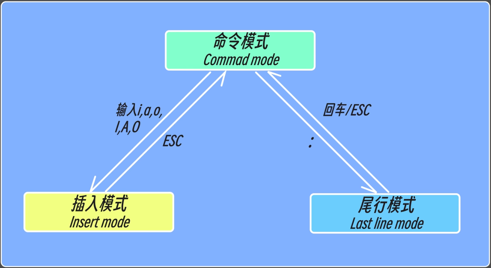

## 三种模式
### 命令模式/normal
##### 移动光标
	`h` `j` `k` `l` 控制光标移动（前/下/上/后）
	`^` /`$` 行首/行尾
	`w`向后移动一个单词，到下一个单词开头
	`e`向后移动一个单词，到当前单词的结尾
	`0`行首
`yy` 复制内容
`p` 粘贴内容
##### 删除
	`dd` 删除整行内容
	`x` 删除单个字
	`dw`删除单词
	`d$`删除从光标到行末
##### 撤销
	`u`  (undo)撤销
	`U`撤销整行的修改
	`ctrl+R`取消撤销
##### 替换
	`r + 要替换的内容`
##### 更改
	`cw`删除当前光标后面的单词，并进入插入模式
##### 快速移动行
	`ctrl + g`显示文件信息及行号
	`G` 最后一行
	`gg` 第一行
	`100G`  / `：100` 跳转到第一百行
	`ctrl + O`回到上次的行
	`ctrl + I`回到最新的行
##### 查找
	`/要查找的内容`  向下查找 
	`？要查找的内容`  向上查找 
	`/hello\c`  / `：set ic` 不区分大小写查找 
##### 括号的匹配
	`%`
##### V可视化
	v选择
	V行选择
	^v块选择
##### 改变大小写
	u变小写
	U变大写
	～反转大小写

`Ctrl` + `f` 向前翻页
`Ctrl` + `b` 向后翻页
`Ctrl` + `u` 向上翻半页
`Ctrl` + `d` 向下翻半页
`vi .vimrc` 设置默认操作
### 插入模式
iI：光标前/行首
aA：光标后/行尾
oO:上一行/下一行
### 尾行模式
`：set number` / `：set nu` 显示行号
`：set nonumber` 关闭行号
##### 替换
	`:1,5s/要替换的内容/替换后的内容/g` 替换1到5行 `g` 全局替换
	`:%1,$%s/要替换的内容/替换后的内容/g` 全部替换
	`:%1,$%s/要替换的内容/替换后的内容/gc` 对每一个提示是否替换
`：r filename`写入文件
`：w filename`存入文件
`sp`分屏
`vsp`分屏
	`^w w`切换窗口
	`^w r`交换窗口
	`^w c`关闭窗口

