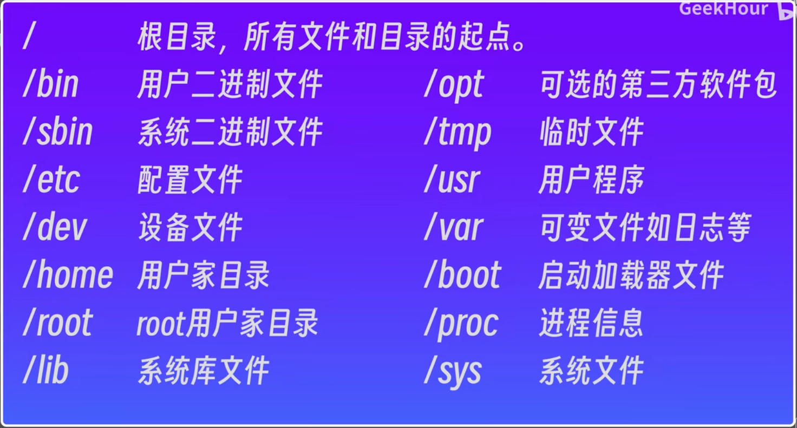

### `ls` 显示当前路径下的文件
	`-l` 显示详细信息
	```markdown
	`-` 表示普通文件
	`d` 目录
	`l` 链接文件
	```
	`-a` 显示隐藏文件
	`-h` 显示文件大小
	`-t` 按修改时间排序
	`-r` 逆序显示
	`-i` 查看i节点
### `ln` 创建链接文件
	`ln 源文件名称 链接文件名称` 格式
	`-s` 表示是软链接
###  `echo` 打印/创建文件
### `cat`查看文件内容
###  `rm` 删除文件/目录 
### `chmod` 更改权限
	`chmod u+x 文件名` 添加权限(u g o)(r w x)
	`chmod 777 文件名` 添加权限(u g o)(r4  w2  x1)
### `touch` 更新文件时间/创建文件
### `pwd` 显示当前路径
### `cd` 切换路径
	`/`  根目录
	`～`  用户的家目录
	`-`  上次路径
	`..` 上层路径
	


- `   /bin` - 基本命令二进制文件
- `/sbin` - 基本的系统二进制文件，通常是 root 运行的
- `/dev` - 设备文件，通常是硬件设备接口文件
- `/etc` - 主机特定的系统配置文件
- `/home` - 系统用户的主目录
- `/lib` - 系统软件通用库
- `/opt` - 可选的应用软件
- `/sys` - 包含系统的信息和配置([第一堂课](https://missing-semester-cn.github.io/2020/course-shell/) 介绍的)
- `/tmp` - 临时文件( `/var/tmp` ) 通常重启时删除
- `/usr/` - 只读的用户数据
    - `/usr/bin` - 非必须的命令二进制文件
    - `/usr/sbin` - 非必须的系统二进制文件，通常是由 root 运行的
    - `/usr/local/bin` - 用户编译程序的二进制文件
- `/var` -变量文件 像日志或缓存
### `cp` 复制文件/目录
	`cp 源文件 复制的文件` 复制操作
	`-r` 复制目录需要递归复制
### `mv` 移动文件/重命名
### `mkdir` 创建目录
	`-p` 创建多级目录
	`mkdir -p folder1/folder2/folder3` 示例
### `du` 查看目录大小/目录结构

